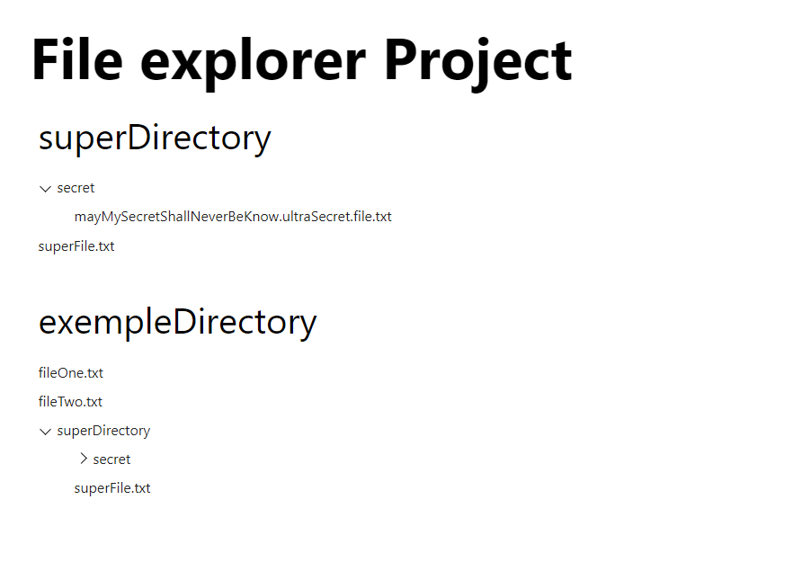

# File Explorer on the Web

This is a [Next.js](https://nextjs.org/) project bootstrapped with [`create-next-app`](https://github.com/vercel/next.js/tree/canary/packages/create-next-app).


## Getting Started

```bash
npm start
```

Open [http://localhost:3000](http://localhost:3000) with your browser to see the result.

## How it's work ?

The server will take the environnement variable `DIRECTORIES` to target which folders to display.  
The Frontend side is completly agnostic of the source of data from the provider. It could be real file and folder, or another type of data (exemple: categories, DB structure, etc).  

We use a React.Context for each Explorer Three allow it to prevent properties drilling and communicate with their own instance of Provider.  
For minimum security, the provider for each folders to display use a "scope" to validate that the file/folder operation doesn't get out of the presented folder.

All the Provider definition are in `./core` which are used for the dependancy inversion of FsSecureProvider  
The folder `playground` have two purpose, it's contain the default `DIRECTORIES` folder on the `npm start` and allow to run unit test on files/folders.

## Server

As we need to use a scope for security per Provider targeting the File System, we need a share a state between each api route to target the right root folder.
The NextJS Server compile each api route on the go, preventing to get a share state; which is we there a custom server on `server.ts`.

### Todos

- Add a11y navigation
- Complete unit test for the scope of file
- Add a layer of security between Front-End and the API
- Cleanup `./server.ts`
